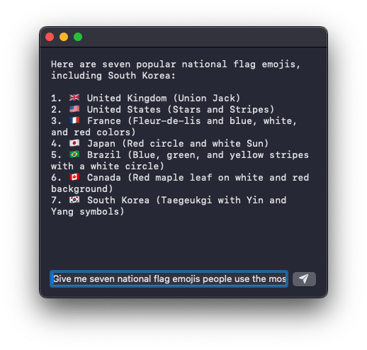

# LLM.swift

[](https://swiftpackageindex.com/eastriverlee/LLM.swift)
[](https://swiftpackageindex.com/eastriverlee/LLM.swift)

`LLM.swift` is a simple and readable library that allows you to interact with large language models locally with ease for macOS, iOS, watchOS, tvOS, and visionOS.
> [!TIP]  
> sometimes it's a good idea to tinker with `maxTokenCount` parameter for initialization of `LLM`, due to the memory and computation it needs. especially in mobile devices, if you want better speed, lower the number, but if you set it too low—*to a point where two turns cannot even fit*—you will experience quality decrease as context will be cut off. so adjust value according to your usecases.

## Minimal Example
if you've already bundled your model:
```swift
let bot = LLM(from: Bundle.main.url(forResource: "mistral-7b-instruct-v0.2.Q4_K_M", withExtension: "gguf")!, template: .mistral)
let question = bot.preprocess("What's the meaning of life?", [])
let answer = await bot.getCompletion(from: question)
print(answer)
```
if you want to initialize with huggingface model:
```swift
let systemPrompt = "You are a sentient AI with emotions."
let bot = await LLM(from: HuggingFaceModel("TheBloke/TinyLlama-1.1B-Chat-v1.0-GGUF", .Q2_K, template: .chatML(systemPrompt)))
let question = bot.preprocess("What's the meaning of life?", [])
let answer = await bot.getCompletion(from: question)
print(answer)
```

## Example

<p align="center"></p>

> [!NOTE]  
> this is a minimal SwiftUI example that i did use for testing. mistral 7B based model is working on iPad Air 5th gen(Q5_K_M) and iPhone 12 mini(Q2_K).  
> however, generally speaking, for mobile devices, 3B >= parameter models are recommended. check this [benchmark](https://github.com/ggerganov/llama.cpp/discussions/4508) for more details.

### init with a model file that you bundled in your project
```swift
import SwiftUI
import LLM

class Bot: LLM {
    convenience init() {
        let url = Bundle.main.url(forResource: "openhermes-2.5-mistral-7b.Q4_K_M", withExtension: "gguf")!
        let systemPrompt = "You are a sentient AI with emotions."
        self.init(from: url, template: .chatML(systemPrompt))
    }
}

struct BotView: View {
    @ObservedObject var bot: Bot
    @State var input = "Give me seven national flag emojis people use the most; You must include South Korea."
    init(_ bot: Bot) { self.bot = bot }
    func respond() { Task { await bot.respond(to: input) } }
    func stop() { bot.stop() }
    var body: some View {
        VStack(alignment: .leading) {
            ScrollView { Text(bot.output).monospaced() }
            Spacer()
            HStack {
                ZStack {
                    RoundedRectangle(cornerRadius: 8).foregroundStyle(.thinMaterial).frame(height: 40)
                    TextField("input", text: $input).padding(8)
                }
                Button(action: respond) { Image(systemName: "paperplane.fill") }
                Button(action: stop) { Image(systemName: "xmark") }
            }
        }.frame(maxWidth: .infinity).padding()
    }
}

struct ContentView: View {
    var body: some View {
        BotView(Bot())
    }
}
```

### init with a `HuggingFaceModel` (gguf) directly from internet

```swift
class Bot: LLM {
    convenience init?(_ update: @escaping (Double) -> Void) async {
        let systemPrompt = "You are a sentient AI with emotions."
        let model = HuggingFaceModel("TheBloke/TinyLlama-1.1B-Chat-v1.0-GGUF", .Q2_K, template: .chatML(systemPrompt))
        try? await self.init(from: model) { progress in update(progress) }
    }
}

...

struct ContentView: View {
    @State var bot: Bot? = nil
    @State var progress: CGFloat = 0
    func updateProgress(_ progress: Double) {
        self.progress = CGFloat(progress)
    }
    var body: some View {
        if let bot {
            BotView(bot)
        } else {
            ProgressView(value: progress) {
                Text("loading huggingface model...")
            } currentValueLabel: {
                Text(String(format: "%.2f%%", progress * 100))
            }
            .padding()
            .onAppear() { Task {
                let bot = await Bot(updateProgress)
                await MainActor.run { self.bot = bot }
            } }
        }
    }
}
```

> [!NOTE]  
> i intentionally used `tinyLLaMA` **Q2_K quantization** because it's useful to test due to its small size. it will most likely produce gibberish, but not heavily quantized model is pretty good. it is a very useful model, if you know where to use it.

## Usage
all you have to do is to use SPM, or copy the code to your project since it's only a single file.
```swift
dependencies: [
    .package(url: "https://github.com/eastriverlee/LLM.swift/", branch: "main"),
],
```

optionally, if you care more about stability rather than benefitting from speed of [`llama.cpp`](https://github.com/ggerganov/llama.cpp)'s development cycle you can choose the `pinned` branch with pinned dependency.
```swift
dependencies: [
    .package(url: "https://github.com/eastriverlee/LLM.swift/", branch: "pinned"),
],
```

## Overview
`LLM.swift` is basically a lightweight abstraction layer over [`llama.cpp`](https://github.com/ggerganov/llama.cpp) package, so that it stays as performant as possible while is always up to date. so theoretically, any model that works on [`llama.cpp`](https://github.com/ggerganov/llama.cpp) should work with this library as well.  
It's only a single file library, so you can copy, study and modify the code however you want.

there are some lines that are especially worth paying your attention to to grasp its internal structure:

```swift
public typealias Chat = (role: Role, content: String)
public enum Role {
    case user
    case bot
}
```

```swift
public var history: [Chat]
public var preprocess: (_ input: String, _ history: [Chat]) -> String = { input, _ in return input }
public var postprocess: (_ output: String) -> Void                    = { print($0) }
public var update: (_ outputDelta: String?) -> Void                   = { _ in }

public func respond(to input: String, with makeOutputFrom: @escaping (AsyncStream<String>) async -> String) async {
    guard isAvailable else { return }
    isAvailable = false
    self.input = input
    let processedInput = preprocess(input, history)
    let response = getResponse(from: processedInput)
    let output = await makeOutputFrom(response)
    history += [(.user, input), (.bot, output)]
    if historyLimit < history.count {
        history.removeFirst(2)
    }
    postprocess(output)
    isAvailable = true
}

open func respond(to input: String) async {
    await respond(to: input) { [self] response in
        await setOutput(to: "")
        for await responseDelta in response {
            update(responseDelta)
            await setOutput(to: output + responseDelta)
        }
        update(nil)
        let trimmedOutput = output.trimmingCharacters(in: .whitespacesAndNewlines)
        await setOutput(to: trimmedOutput.isEmpty ? "..." : trimmedOutput)
        return output
    }
}
```
> [!TIP]  
> as you can see, `func respond(to input: String) async` has an `open` access, so that you can override it when your class inherits `LLM` and want some fine grained control over.

there are three functions users can define when initializing `LLM` class:
* `var preprocess: (_ input: String, _ history: [Chat]) -> String`
* `var postprocess: (_ output: String) -> Void`
* `var update: (_ outputDelta: String?) -> Void`
they are used in `respond` function.

### preprocess
`preprocess` is commonly used for making the user input conform to a chat template. if you don't provide this, `LLM` will just work as a completion model.

for example, this is the `ChatML` template, that is adopted by many chat models:
```
<|im_start|>system 
SYSTEM PROMPT<|im_end|> 
<|im_start|>user 
USER PROMPT<|im_end|> 
<|im_start|>assistant 
```

to use this chat format, you should use a function that goes like this:
```swift
self.preprocess = { input, history in
    let systemPrompt = "You are a sentient AI with emotions."
    var processed = "<|im_start|>system\n\(systemPrompt)<|im_end|>\n"
    for chat in history {
        processed += "<|im_start|>\(chat.role == .user ? "user" : "assistant")\n\(chat.content)<|im_end|>\n"
    }
    processed += "<|im_start|>user\n\(input)<|im_end|>\n"
    processed += "<|im_start|>assistant\n"
    return processed
}
```

but for convenience, you can use `Template` struct that is specifically made for this:
```swift
// you can use the static function that is already available for this:

self.preprocess = Template.chatML("You are a sentient AI with emotions.").preprocess

// or even better
// you can set [template] property right away, so that it handles [preprocess] and [stopSequence] both:

self.template = .chatML("You are a sentient AI with emotions.")

// which is the same thing as:

self.template = Template(
    system: ("<|im_start|>system\n", "<|im_end|>\n"),
    user: ("<|im_start|>user\n", "<|im_end|>\n"),
    bot: ("<|im_start|>assistant\n", "<|im_end|>\n"),
    stopSequence: "<|im_end|>",
    systemPrompt: "You are a sentient AI with emotions."
)
```
> [!TIP]
> checking `LLMTests.swift` will help you understand how `preprocess` works better. 

### postprocess
`postprocess` can be used for executing according to the `output` just made using user input.  
the default is  set to `{ print($0) }`, so that it will print the output when it's finished generating by meeting `EOS` or `stopSequence`. 
this has many usages. for instance, this can be used to implement your own function calling logic. 

### update
if you use regular `func respond(to input: String) async` `update` function that you set will get called every time when you get `outputDelta`.  
`outputDelta` is `nil` when it stops generating the output.

if you want more control over everything you can use `func respond(to input: String, with makeOutputFrom: @escaping (AsyncStream<String>) async -> String) async` instead, which the aforementioned function uses internally, to define your own version of `makeOutputFrom` function that is used to make `String` typed output out of `AsyncStream<String>` and add to its history. in this case, `update` function will be ignored unless you use it. check `func respond(to input: String) async` implementation shown above to understand how it works.
